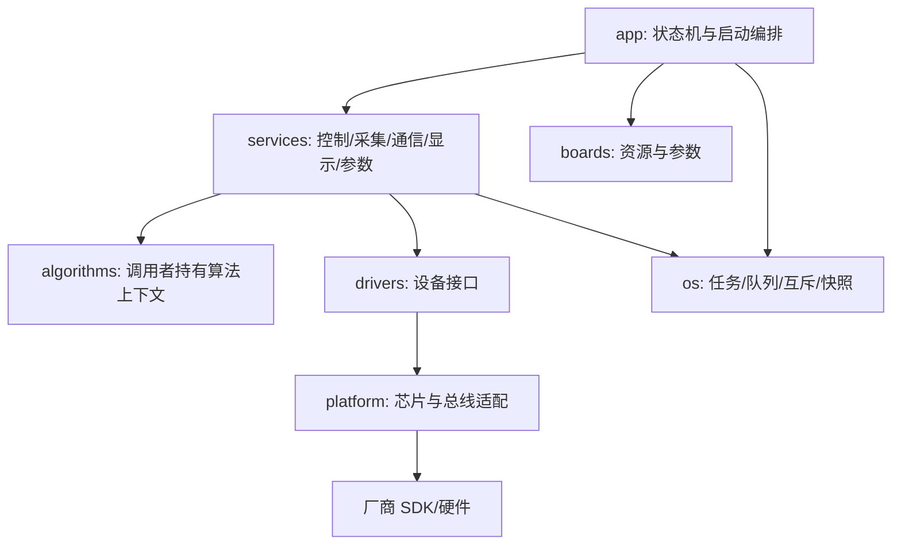

# 架构与模块接口

公共算法与协议接口只有标准 C 数据类型，算法不包含 HAL/RTOS/业务主头文件。任务拥有运行状态；通信提交命令，显示与遥测读取快照。旧设备实现保留源头注释；legacy 表示保留接口命名的适配区，不允许新增跨模块可写 extern 状态。头文件包含循环已检查；这不等于证明所有运行时依赖或调用时序。

协议回调中的帧借用仅在同步调用内有效，异步处理必须复制。控制命令按值入队且不阻塞，队列满返回 busy；原始 UART 接收队列丢包后重置解码器，目标速度受 500ms 超时保护。任务快照用短临界区复制，临界区里不进行 I/O、计算或等待。设备接口按各头文件约定调用上下文、单位与返回值；初始化在启动编排中检查创建结果。

malloc/栈溢出/断言/致命设备错误进入停止输出并锁定的故障路径；恢复要求复位与重新初始化。现有工程没有已验证的硬件看门狗恢复，不能宣称自动恢复或自动重新解锁。看门狗接线、超时、复位原因记录和启动回归列入硬件验收。
